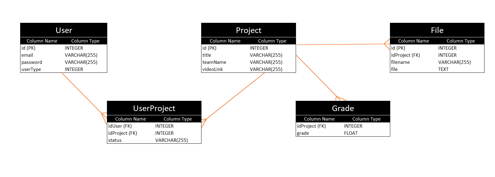

# Aplicație web acordarea anonimă de note

## Cuprins

- [Despre aplicatie](#despre-aplicatie)
- [Obiectiv](#obiectiv)
- [Descriere](#descriere)
- [Functionalitati](#functionalitati)
- [Schema bazei de date](#schema-bazei-de-date)
- [Cum se pornește aplicația](#pornire-aplicatie)

## Despre aplicatie

### Obiectiv

Realizarea unei aplicații web care să permită acordarea de punctaje anonime de catre un juriu anonim de studenti proiectului altor studenti.

### Descriere

Aplicația trebuie să permită acordarea unui punctaj unui proiect de către un juriu anonim de colegi.

Platforma este bazată pe o aplicație web cu arhitectură de tip Single Page Application accesibilă în browser de pe desktop, dispozitive mobile sau tablete (considerând preferințele utilizatorului).

• Front-end-ul este realizat in React.js
• Back-end-ul are o interfață REST și este realizat în node.js
• Stocarea se face peste o bază relațională (SQLite) și accesul la baza se va face prin intermediul unui ORM (Sequelize)

### Functionalitati

• Ca student membru în echipa unui proiect (MP) pot să îmi adaug un proiect și să definesc o serie de livrabile partiale ale proiectului. La înscriere devin automat și parte din grupul de posibili evaluatori

• Ca MP pentru un livrabil partial pot adăuga un video demonstrativ pentru proiect sau un link la un server unde poate fi accesat proiectul

• La data unui livrabil parțial, ca student care nu este MP pot fi selectat aleatoriu să fac parte din juriul unui proiect. Pot acorda o notă proiectului doar dacă am fost selectat în juriul pentru el.

• Nota la un proiect este anonimă, iar nota totală se calculează omițând cea mai mare și cea mai mică notă. Notele sunt de la 1-10 cu până la 2 cifre fracționare.

• Ca profesor, pot vedea evaluarea pentru fiecare proiect, fără a vedea însă identitatea membrilor juriului.

• Aplicația are și un sistem de permisiuni. Doar un membru al juriului poate să adauge/modifice note și doar notele lui pe o perioadă limitată de timp

## Schema bazei de date

## Cum se pornește aplicația

• Se instalează modulele mai întâi din gui și server (de preferat să se deschidă 2 terminale)

•cd server

•npm install

Pentru gui

•cd gui

•npm install

• Aplicația se pornește cu npm install în ambele ( mai întâi se pornește server-ul)
